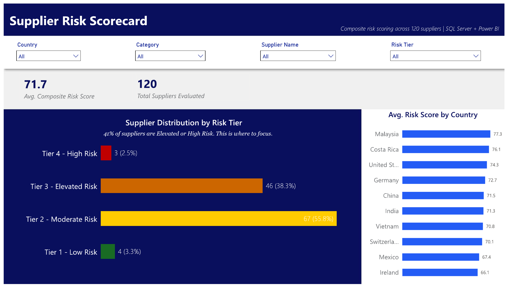
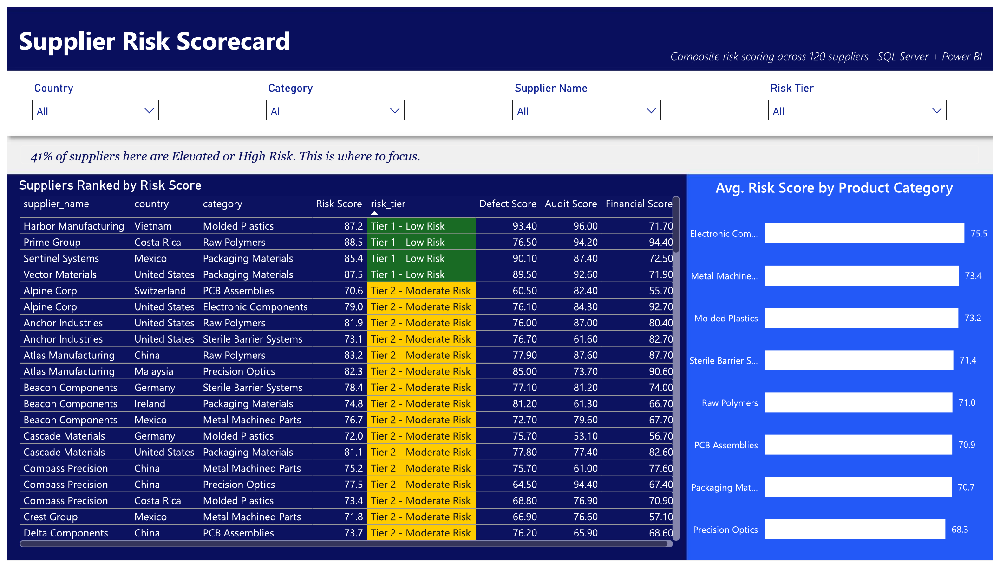
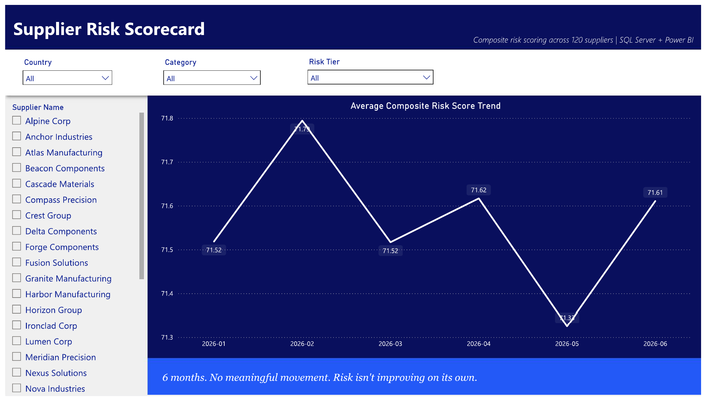

# Supplier Risk Scorecard

Weighted risk scoring model for supplier quality data. Built in SQL Server, visualized in Power BI. Same basic idea as a credit scorecard: normalize a set of metrics, weight them, add them up, sort suppliers into tiers.

> Dataset is synthetic. Built to match the structure of real medical device supply chain quality data, but no proprietary or employer data here.

## The problem

Most supplier quality reporting is a pile of separate numbers: defect rate here, complaint count there, last audit score somewhere else. Nobody can compare Supplier A to Supplier B without pulling all of that together manually, and everyone who does it ends up weighting things differently in their head.

This gives you one number per supplier instead, and a tier that tells you what to actually do about it.

## Dashboard

**Risk Summary**: portfolio-level view. Distribution across tiers, average score, risk concentration by country.

**Risk Breakdown**: supplier-level detail. Full ranked table, risk drivers by product category.

**Trend**: six-month movement in the portfolio average, filterable by supplier and tier.

The full `.pbix` file is included in this repo. It connects to a local SQL Server instance and won't refresh without that connection, but opens with all data, visuals, and DAX measures intact. The model, relationships, and calculations are there to inspect.

## How it's built

Scoring logic lives in SQL, not in the BI layer. Data goes into `supplier_quality_data`. `02_risk_score_calculation.sql` handles normalization, weighting, and aggregation, and writes to `supplier_risk_scores`. `03_risk_tier_classification.sql` builds a view (`vw_supplier_risk_tiers`) that buckets suppliers into tiers. Power BI connects straight to SQL Server and reads those two objects.

Kept it this way on purpose. The scoring rule is a business rule, and I'd rather have that versioned in SQL than buried in a DAX measure someone forgets is doing math.

## Dataset

`data/supplier_quality_data.csv`: 120 suppliers, 8 categories, 10 countries. Key fields:

| Field | What it's for |
|---|---|
| `defective_units` / `total_units_shipped` | Defect rate |
| `complaint_count`, `avg_severity_score`, `recurrence_flag` | Complaint history |
| `on_time_delivery_rate` | Delivery reliability |
| `audit_score`, `critical_findings_last_audit` | Audit results |
| `financial_stability_score` | Financial risk proxy |

## Scoring

Composite score ranges from 0 (worst) to 100 (best), weighted sum of five factors:

| Driver | Weight | Why |
|---|---|---|
| Defect Rate | 25% | Most direct signal of product quality |
| Complaints & Severity | 20% | Volume, severity, and recurrence; a repeat issue counts against you harder than a one off |
| Delivery Reliability | 15% | Whether they can actually deliver on time |
| Audit / QMS Health | 25% | Weighted as high as defect rate because it's forward looking, not historical |
| Financial Stability | 15% | A supplier can have perfect quality and still be a risk if they're going under |

Tiers:

| Tier | Score | Action |
|---|---|---|
| Tier 1, Low Risk | 85 to 100 | Standard monitoring |
| Tier 2, Moderate Risk | 70 to 84 | Routine monitoring |
| Tier 3, Elevated Risk | 50 to 69 | Corrective action plan required |
| Tier 4, High Risk | Below 50 | Critical review / requalification |

Weights and thresholds aren't hardcoded assumptions I'm married to. Full logic and formulas are in [`docs/methodology.md`](docs/methodology.md).

## What the current run shows

120 suppliers total:

| Tier | Count | % | Avg Score |
|---|---|---|---|
| Tier 1 | 4 | 3.3% | 87.2 |
| Tier 2 | 67 | 55.8% | 77.4 |
| Tier 3 | 46 | 38.3% | 63.9 |
| Tier 4 | 3 | 2.5% | 42.1 |

Tier 3 is the largest bucket by far, and the one where a corrective action program would have the most impact, not Tier 4, which is small enough to handle case by case. Electronic Components suppliers score best on average, Precision Optics worst. Risk isn't clustered in a single country either. It's spread across the dataset, which is the point of scoring at the supplier level instead of eyeballing by region.

## Structure

- `data/supplier_quality_data.csv`: source dataset
- `sql/01_data_exploration.sql`: profiling and validation
- `sql/02_risk_score_calculation.sql`: composite score logic
- `sql/03_risk_tier_classification.sql`: tier assignment view
- `docs/methodology.md`: full scoring methodology
- `docs/dax_measures.md`: Power BI DAX measures
- `docs/screenshots/`: dashboard images
- `dashboard/dashboard_overview.md`: dashboard structure and screenshots
- `*.pbix`: full Power BI report file
- `README.md`

## Stack

SQL Server for scoring logic. Power BI (Import mode, connects straight to SQL Server) for the report. Python/pandas only to generate the synthetic dataset, not part of the actual pipeline.

## What's not done yet

Weights and thresholds here are based on judgment, not fitted against real outcome data. Before this would run in production, I'd want to check the weights against actual supply disruptions or quality escapes, get sign off on where the tier cutoffs sit, and figure out a process for manual overrides. Splitting scoring (SQL) from presentation (Power BI) means recalibration doesn't require touching the dashboard at all.

## About

Diego Jiménez. Sr. Associate, Data & Process Analyst at Genpact. Background in medical device quality and manufacturing analytics (Genpact, Edwards Lifesciences).

[LinkedIn](https://www.linkedin.com/in/diego-jim%C3%A9nez-a8aa3a27b/)
